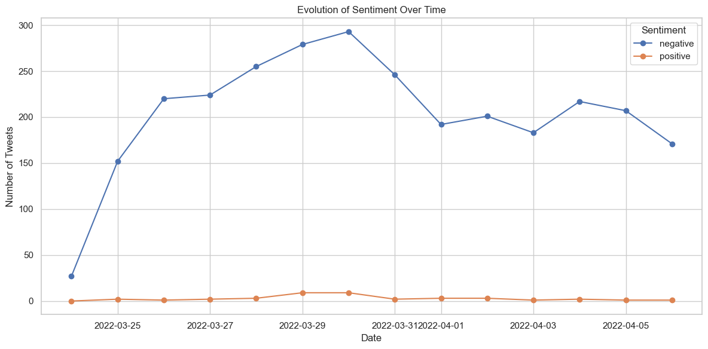
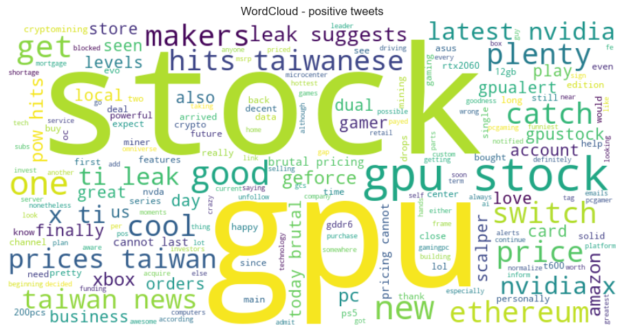

# 🧠 GPU Shortage Sentiment Analysis (GPU market analysis V1.0)

  
  
  


Sentiment analysis on tweets related to the main GPU manufacturers (NVIDIA, AMD, Intel) during the **global graphics card shortage** (2020–2021), using NLP techniques and pretrained models from Hugging Face.

---

## 📁 Project Structure

- `data/` — Tweet dataset  
- `images/` — Output images  
- `notebooks/` — Main notebook  
- `src/` — Reusable utility functions  
- `LICENSE` — Project license  
- `README.md` — Documentation file  
- `requirements.txt` — Required libraries
 
---

## 🤗 Sentiment Analysis

The model used:

> `distilbert-base-uncased-finetuned-sst-2-english`

Using Hugging Face's `pipeline`, sentiment is classified as:
- `positive`
- `negative`

---

## 📊 Analysis Performed

- Sentiment distribution of tweets  
- Sentiment trends over time  
- Score boxplots  
- WordClouds by sentiment  
- Average retweets per sentiment  
- Brand-wise analysis (NVIDIA, AMD, Intel, others)  

---

## 📷 Sample Outputs

| Sentiment Distribution | Positive WordCloud |
|------------------------|--------------------|
|  |  |

---

## ⚙️ How to Run

1. Clone the repository  
2. Install the required packages:
   ```bash
   pip install -r requirements.txt


## Requirements

To run this project, make sure you have the following Python libraries installed:

- pandas  
- numpy  
- matplotlib  
- seaborn  
- nltk  
- transformers  
- scikit-learn  
- wordcloud

## 📄 Licenza

This project is released under the Apache 2.0 license.
The original tweet data is not redistributed due to licensing restrictions.

---

## 👤 Author

Salvatore Zizzi — Statistics graduate, passionate about NLP and AI. 
📫 [LinkedIn](https://www.linkedin.com/in/salvatore-zizzi-242151107/)

